# Tổng Hợp UML

## `sơ đồ lớp UC03.puml`
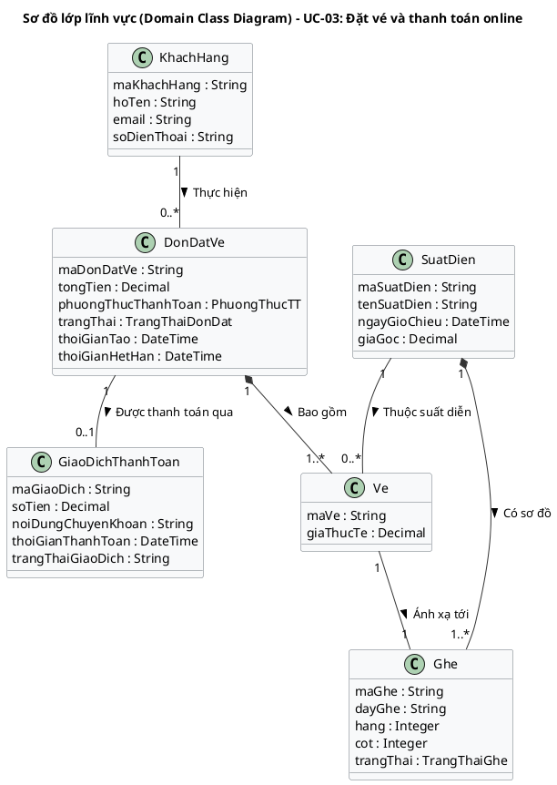
```plantuml
@startuml UC03_DomainClassDiagram
skinparam defaultFontName Arial
skinparam classAttributeIconSize 0
skinparam classBackgroundColor #F8F9FA
skinparam classBorderColor #6C757D
skinparam arrowColor #333333

title Sơ đồ lớp lĩnh vực (Domain Class Diagram) - UC-03: Đặt vé và thanh toán online

class KhachHang {
  maKhachHang : String
  hoTen : String
  email : String
  soDienThoai : String
}

class SuatDien {
  maSuatDien : String
  tenSuatDien : String
  ngayGioChieu : DateTime
  giaGoc : Decimal
}

class Ghe {
  maGhe : String
  dayGhe : String
  hang : Integer
  cot : Integer
  trangThai : TrangThaiGhe
}

class DonDatVe {
  maDonDatVe : String
  tongTien : Decimal
  phuongThucThanhToan : PhuongThucTT
  trangThai : TrangThaiDonDat
  thoiGianTao : DateTime
  thoiGianHetHan : DateTime
}

class Ve {
  maVe : String
  giaThucTe : Decimal
}

class GiaoDichThanhToan {
  maGiaoDich : String
  soTien : Decimal
  noiDungChuyenKhoan : String
  thoiGianThanhToan : DateTime
  trangThaiGiaoDich : String
}
' Các mối quan hệ nghiệp vụ
KhachHang "1" -- "0..*" DonDatVe : Thực hiện >
DonDatVe "1" *-- "1..*" Ve : Bao gồm >
Ve "1" -- "1" Ghe : Ánh xạ tới >
SuatDien "1" *-- "1..*" Ghe : Có sơ đồ >
SuatDien "1" -- "0..*" Ve : Thuộc suất diễn >
DonDatVe "1" -- "0..1" GiaoDichThanhToan : Được thanh toán qua >

@enduml
```

## `sơ đồ lớp UC04.puml`
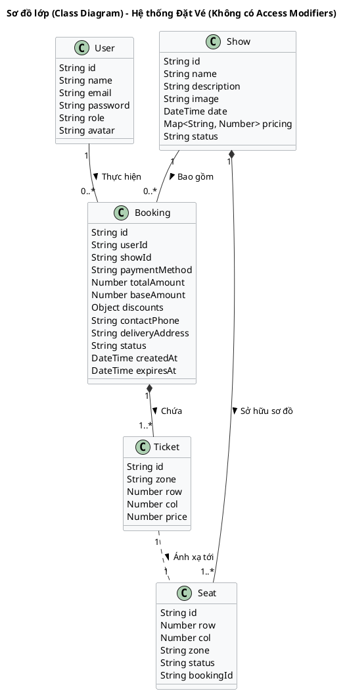
```plantuml
@startuml ClassDiagram_NoModifiers
skinparam defaultFontName Arial
skinparam classAttributeIconSize 0
skinparam classBackgroundColor #F8F9FA
skinparam classBorderColor #6C757D
skinparam arrowColor #333333

title Sơ đồ lớp (Class Diagram) - Hệ thống Đặt Vé (Không có Access Modifiers)

class User {
  String id
  String name
  String email
  String password
  String role
  String avatar
}

class Show {
  String id
  String name
  String description
  String image
  DateTime date
  Map<String, Number> pricing
  String status
}

class Seat {
  String id
  Number row
  Number col
  String zone
  String status
  String bookingId
}

class Booking {
  String id
  String userId
  String showId
  String paymentMethod
  Number totalAmount
  Number baseAmount
  Object discounts
  String contactPhone
  String deliveryAddress
  String status
  DateTime createdAt
  DateTime expiresAt
}

class Ticket {
  String id
  String zone
  Number row
  Number col
  Number price
}

' Mối quan hệ giữa các lớp
User "1" -- "0..*" Booking : Thực hiện >
Show "1" -- "0..*" Booking : Bao gồm >
Show "1" *-- "1..*" Seat : Sở hữu sơ đồ >
Booking "1" *-- "1..*" Ticket : Chứa >
Ticket "1" .. "1" Seat : Ánh xạ tới >

@enduml
```

## `sơ đồ lớp UC06.puml`
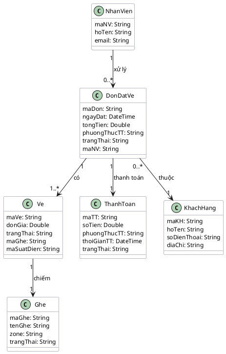
```plantuml
@startuml UC06_ClassDiagram
skinparam classBackgroundColor #FFFFFF
skinparam classBorderColor #6C757D
skinparam defaultFontName Arial
skinparam defaultFontSize 12

class NhanVien {
  maNV: String
  hoTen: String
  email: String
}

class DonDatVe {
  maDon: String
  ngayDat: DateTime
  tongTien: Double
  phuongThucTT: String
  trangThai: String
  maNV: String
}

class Ve {
  maVe: String
  donGia: Double
  trangThai: String
  maGhe: String
  maSuatDien: String
}

class Ghe {
  maGhe: String
  tenGhe: String
  zone: String
  trangThai: String
}

class ThanhToan {
  maTT: String
  soTien: Double
  phuongThucTT: String
  thoiGianTT: DateTime
  trangThai: String
}

class KhachHang {
  maKH: String
  hoTen: String
  soDienThoai: String
  diaChi: String
}

NhanVien "1" --> "0..*" DonDatVe : xử lý
DonDatVe "1" --> "1..*" Ve : có
DonDatVe "1" --> "1" ThanhToan : thanh toán
DonDatVe "0..*" --> "1" KhachHang : thuộc
Ve "1" --> "1" Ghe : chiếm

@enduml
```

## `sơ đồ lớp tổng thể.puml`
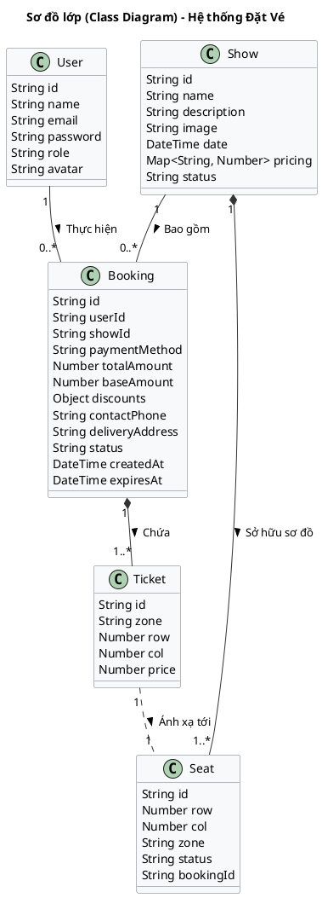
```plantuml
@startuml ClassDiagram_TicketBooking
skinparam defaultFontName Arial
skinparam classAttributeIconSize 0
skinparam classBackgroundColor #F8F9FA
skinparam classBorderColor #6C757D
skinparam arrowColor #333333

title Sơ đồ lớp (Class Diagram) - Hệ thống Đặt Vé

class User {
  String id
  String name
  String email
  String password
  String role
  String avatar
}

class Show {
  String id
  String name
  String description
  String image
  DateTime date
  Map<String, Number> pricing
  String status
}

class Seat {
  String id
  Number row
  Number col
  String zone
  String status
  String bookingId
}

class Booking {
  String id
  String userId
  String showId
  String paymentMethod
  Number totalAmount
  Number baseAmount
  Object discounts
  String contactPhone
  String deliveryAddress
  String status
  DateTime createdAt
  DateTime expiresAt
}

class Ticket {
  String id
  String zone
  Number row
  Number col
  Number price
}

' Mối quan hệ giữa các lớp
User "1" -- "0..*" Booking : Thực hiện >
Show "1" -- "0..*" Booking : Bao gồm >
Show "1" *-- "1..*" Seat : Sở hữu sơ đồ >
Booking "1" *-- "1..*" Ticket : Chứa >
Ticket "1" .. "1" Seat : Ánh xạ tới >

@enduml
```

## `sơ đồ use case tổng quan.puml`
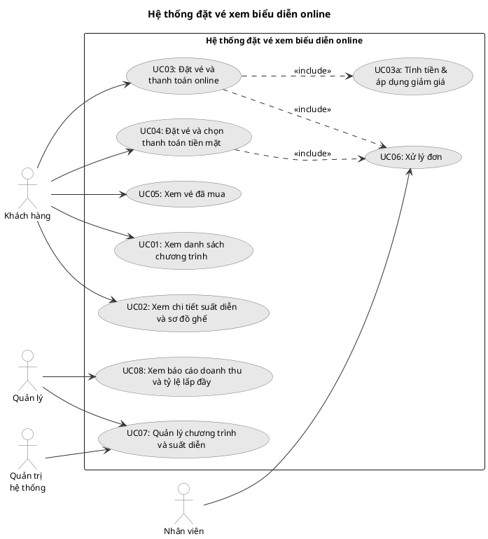
```plantuml
@startuml HeThongDatVe
skinparam defaultFontName Arial
skinparam defaultFontSize 12
skinparam usecaseBackgroundColor #E8E8E8
skinparam usecaseBorderColor #6C757D
skinparam actorBackgroundColor #FFFFFF
skinparam actorBorderColor #6C757D
skinparam ArrowColor #333333
left to right direction

title Hệ thống đặt vé xem biểu diễn online

actor "Khách hàng" as KH
actor "Quản lý" as QL
actor "Quản trị\nhệ thống" as QTHT
actor "Nhân viên" as NV

rectangle "Hệ thống đặt vé xem biểu diễn online" {
  usecase "UC01: Xem danh sách\nchương trình" as UC01
  usecase "UC02: Xem chi tiết suất diễn\nvà sơ đồ ghế" as UC02
  usecase "UC03: Đặt vé và\nthanh toán online" as UC03
  usecase "UC03a: Tính tiền &\náp dụng giảm giá" as UC03a
  usecase "UC04: Đặt vé và chọn\nthanh toán tiền mặt" as UC04
  usecase "UC05: Xem vé đã mua" as UC05
  usecase "UC06: Xử lý đơn" as UC06
  usecase "UC07: Quản lý chương trình\nvà suất diễn" as UC07
  usecase "UC08: Xem báo cáo doanh thu\nvà tỷ lệ lấp đầy" as UC08
}

' Khách hàng
KH --> UC03
KH --> UC04
KH --> UC05
KH --> UC01
KH --> UC02

' Quản lý
QL --> UC08
QL --> UC07

' Quản trị hệ thống
QTHT --> UC07

' Nhân viên
NV --> UC06

' Relationships
UC03 ..> UC03a : <<include>>
UC03 ..> UC06 : <<include>>
UC04 ..> UC06 : <<include>>

@enduml
```

## `quy trình nghiệp vụ.puml`
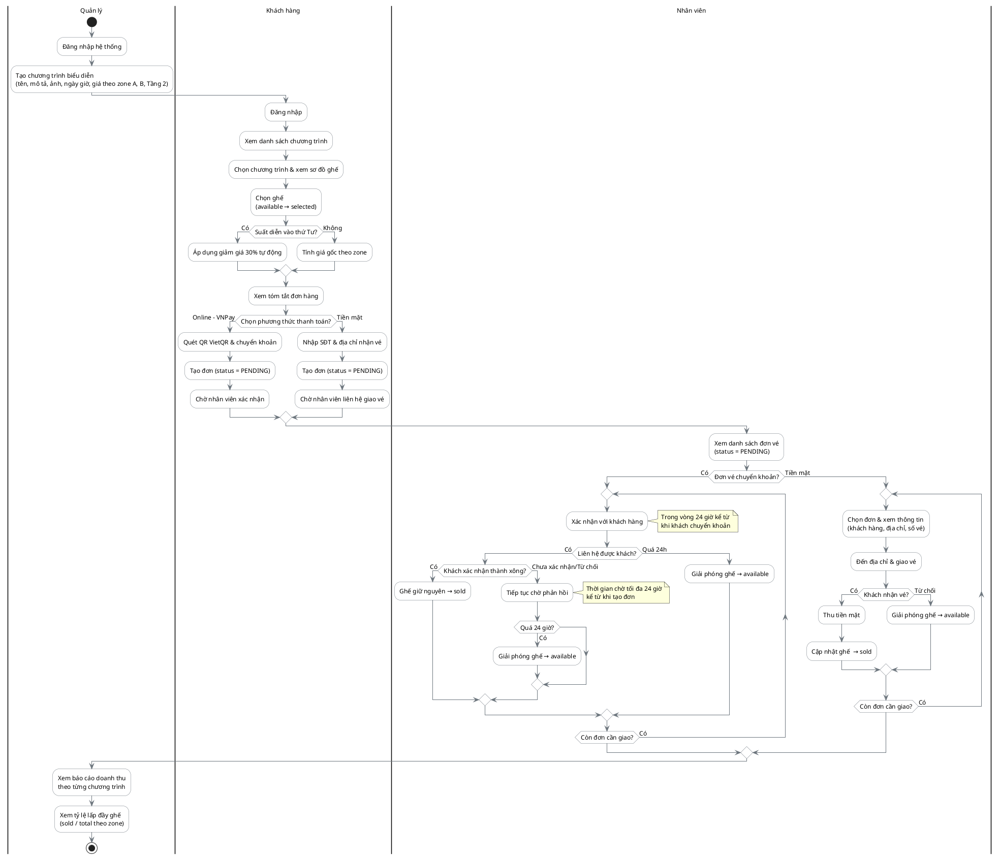
```plantuml
@startuml QuyTrinhNghiepVu
skinparam linetype ortho
skinparam defaultFontName Arial
skinparam defaultFontSize 12
skinparam ActivityBackgroundColor #FFFFFF
skinparam ActivityBorderColor #6C757D
skinparam ArrowColor #6C757D

|Quản lý|
start
:Đăng nhập hệ thống;
:Tạo chương trình biểu diễn
(tên, mô tả, ảnh, ngày giờ, giá theo zone A, B, Tầng 2);

|Khách hàng|
:Đăng nhập;
:Xem danh sách chương trình;
:Chọn chương trình & xem sơ đồ ghế;
:Chọn ghế
(available → selected);

if (Suất diễn vào thứ Tư?) then (Có)
  :Áp dụng giảm giá 30% tự động;
else (Không)
  :Tính giá gốc theo zone;
endif

:Xem tóm tắt đơn hàng;

if (Chọn phương thức thanh toán?) then (Online - VNPay)
  :Quét QR VietQR & chuyển khoản;
  :Tạo đơn (status = PENDING);
  :Chờ nhân viên xác nhận;
else (Tiền mặt)
  :Nhập SĐT & địa chỉ nhận vé;
  :Tạo đơn (status = PENDING);
  :Chờ nhân viên liên hệ giao vé;
endif

|Nhân viên|
:Xem danh sách đơn vé
(status = PENDING);

if (Đơn vé chuyển khoản?) then (Có)

  repeat

  :Xác nhận với khách hàng;

  note right
  Trong vòng 24 giờ kể từ
  khi khách chuyển khoản
  end note

  if (Liên hệ được khách?) then (Có)

      if (Khách xác nhận thành xông?) then (Có)

    :Ghế giữ nguyên → sold;

      else (Chưa xác nhận/Từ chối)

          :Tiếp tục chờ phản hồi;

          note right
          Thời gian chờ tối đa 24 giờ
          kể từ khi tạo đơn
          end note

          if (Quá 24 giờ?) then (Có)
              :Giải phóng ghế → available;
          endif
endif

  else (Quá 24h)
  : Giải phóng ghế → available;

  endif
  repeat while (Còn đơn cần giao?) is (Có)
  

else (Tiền mặt)

  repeat

    :Chọn đơn & xem thông tin
(khách hàng, địa chỉ, số vé);
    :Đến địa chỉ & giao vé;

    if (Khách nhận vé?) then (Có)
      :Thu tiền mặt;
      :Cập nhật ghế  → sold;
    else (Từ chối)
      :Giải phóng ghế → available;
    endif

  repeat while (Còn đơn cần giao?) is (Có)

endif

|Quản lý|
:Xem báo cáo doanh thu
theo từng chương trình;
:Xem tỷ lệ lấp đầy ghế
(sold / total theo zone);

stop
@enduml
```

## `quy trình nghiệp vụ UC06.puml`
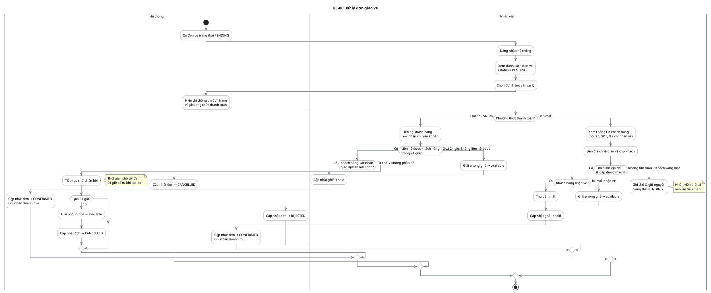
```plantuml
@startuml UC06_XuLyDonGiaoVe
skinparam linetype ortho
skinparam defaultFontName Arial
skinparam defaultFontSize 12
skinparam ActivityBackgroundColor #FFFFFF
skinparam ActivityBorderColor #6C757D
skinparam ArrowColor #6C757D

title UC-06: Xử lý đơn giao vé

|Hệ thống|
start
:Có đơn vé trạng thái PENDING;

|Nhân viên|
:Đăng nhập hệ thống;
:Xem danh sách đơn vé\n(status = PENDING);
:Chọn đơn hàng cần xử lý;

|Hệ thống|
:Hiển thị thông tin đơn hàng\nvà phương thức thanh toán;

|Nhân viên|
if (Phương thức thanh toán?) then (Online - VNPay)

  :Liên hệ khách hàng\nxác nhận chuyển khoản;

  if (Liên hệ được khách hàng\ntrong 24 giờ?) then (Có)

    if (Khách hàng xác nhận\ngiao dịch thành công?) then (Có)
      :Cập nhật ghế → sold;
      |Hệ thống|
      :Cập nhật đơn → CONFIRMED\nGhi nhận doanh thu;
    else (Từ chối / Không phản hồi)
      :Tiếp tục chờ phản hồi;
      note right
        Thời gian chờ tối đa
        24 giờ kể từ khi tạo đơn
      end note
      if (Quá 24 giờ?) then (Có)
        :Giải phóng ghế → available;
        |Hệ thống|
        :Cập nhật đơn → CANCELLED;
      endif
    endif

  else (Quá 24 giờ, không liên hệ được)
    |Nhân viên|
    :Giải phóng ghế → available;
    |Hệ thống|
    :Cập nhật đơn → CANCELLED;
  endif

else (Tiền mặt)

  |Nhân viên|
  :Xem thông tin khách hàng\n(họ tên, SĐT, địa chỉ nhận vé);
  :Đến địa chỉ & giao vé cho khách;

  if (Tìm được địa chỉ\n& gặp được khách?) then (Có)

    if (Khách hàng nhận vé?) then (Có)
      :Thu tiền mặt;
      :Cập nhật ghế → sold;
      |Hệ thống|
      :Cập nhật đơn → CONFIRMED\nGhi nhận doanh thu;
    else (Từ chối nhận vé)
      |Nhân viên|
      :Giải phóng ghế → available;
      |Hệ thống|
      :Cập nhật đơn → REJECTED;
    endif

  else (Không tìm được / Khách vắng mặt)
    |Nhân viên|
    :Ghi chú & giữ nguyên\ntrạng thái PENDING;
    note right
      Nhân viên thử lại
      vào lần tiếp theo
    end note
  endif

endif

stop
@enduml
```

## `sơ đồ hoạt động UC03.puml`
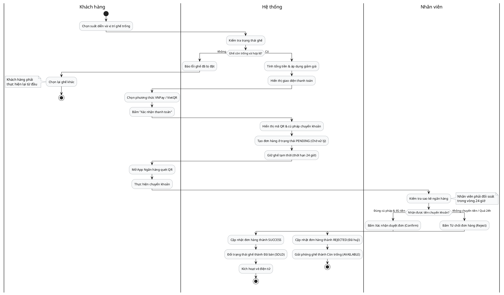
```plantuml
@startuml UC03_ActivityDiagram
skinparam ActivityBackgroundColor #F8F9FA
skinparam ActivityBorderColor #6C757D
skinparam ActivityDiamondBackgroundColor #F8F9FA
skinparam ActivityDiamondBorderColor #6C757D
skinparam noteBackgroundColor #F8F9FA
skinparam noteBorderColor #6C757D

|Khách hàng|
start
:Chọn suất diễn và vị trí ghế trống;

|Hệ thống|
:Kiểm tra trạng thái ghế;
if (Ghế còn trống và hợp lệ?) then (Không)
  :Báo lỗi ghế đã bị đặt;
  |Khách hàng|
  :Chọn lại ghế khác;
  note left: Khách hàng phải\nthực hiện lại từ đầu
  stop
else (Có)
  |Hệ thống|
  :Tính tổng tiền & áp dụng giảm giá;
  :Hiển thị giao diện thanh toán;
  
  |Khách hàng|
  :Chọn phương thức VNPay / VietQR;
  :Bấm "Xác nhận thanh toán";
  
  |Hệ thống|
  :Hiển thị mã QR & cú pháp chuyển khoản;
  :Tạo đơn hàng ở trạng thái PENDING (Chờ xử lý);
  :Giữ ghế tạm thời (thời hạn 24 giờ);
  
  |Khách hàng|
  :Mở App Ngân hàng quét QR;
  :Thực hiện chuyển khoản;

  |Nhân viên|
  :Kiểm tra sao kê ngân hàng;
  note right: Nhân viên phải đối soát\ntrong vòng 24 giờ
  
  if (Nhận được tiền chuyển khoản?) then (Đúng cú pháp & đủ tiền)
    :Bấm Xác nhận duyệt đơn (Confirm);
    
    |Hệ thống|
    :Cập nhật đơn hàng thành SUCCESS;
    :Đổi trạng thái ghế thành Đã bán (SOLD);
    :Kích hoạt vé điện tử;
    stop
    
  else (Không chuyển tiền / Quá 24h)
    |Nhân viên|
    :Bấm Từ chối đơn hàng (Reject);
    
    |Hệ thống|
    :Cập nhật đơn hàng thành REJECTED (Đã huỷ);
    :Giải phóng ghế thành Còn trống (AVAILABLE);
    stop
  endif
endif

@enduml
```

## `sơ đồ hoạt động UC04.puml`
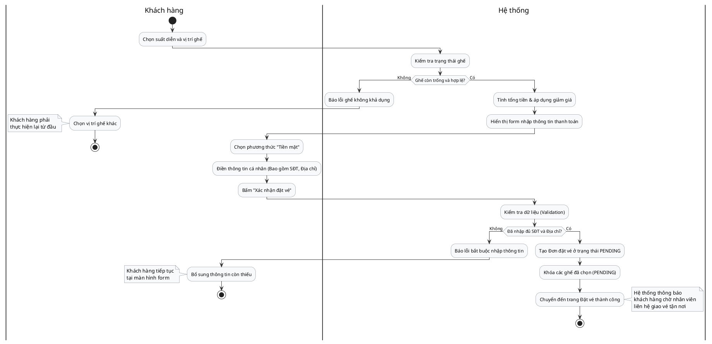
```plantuml
@startuml UC04_ActivityDiagram
skinparam defaultFontName Arial
skinparam classAttributeIconSize 0
skinparam classBackgroundColor #F8F9FA
skinparam classBorderColor #6C757D
skinparam arrowColor #333333
skinparam ActivityBackgroundColor #F8F9FA
skinparam ActivityBorderColor #6C757D
skinparam ActivityDiamondBackgroundColor #F8F9FA
skinparam ActivityDiamondBorderColor #6C757D
skinparam noteBackgroundColor #F8F9FA
skinparam noteBorderColor #6C757D

|Khách hàng|
start
:Chọn suất diễn và vị trí ghế;

|Hệ thống|
:Kiểm tra trạng thái ghế;
if (Ghế còn trống và hợp lệ?) then (Không)
  :Báo lỗi ghế không khả dụng;
  |Khách hàng|
  :Chọn vị trí ghế khác;
  note left: Khách hàng phải\nthực hiện lại từ đầu
  stop
else (Có)
  |Hệ thống|
  :Tính tổng tiền & áp dụng giảm giá;
  :Hiển thị form nhập thông tin thanh toán;
  
  |Khách hàng|
  :Chọn phương thức "Tiền mặt";
  :Điền thông tin cá nhân (Bao gồm SĐT, Địa chỉ);
  :Bấm "Xác nhận đặt vé";
  
  |Hệ thống|
  :Kiểm tra dữ liệu (Validation);
  if (Đã nhập đủ SĐT và Địa chỉ?) then (Không)
    :Báo lỗi bắt buộc nhập thông tin;
    |Khách hàng|
    :Bổ sung thông tin còn thiếu;
    note left: Khách hàng tiếp tục\ntại màn hình form
    stop
  else (Có)
    |Hệ thống|
    :Tạo Đơn đặt vé ở trạng thái PENDING;
    :Khóa các ghế đã chọn (PENDING);
    :Chuyển đến trang Đặt vé thành công;
    note right
      Hệ thống thông báo
      khách hàng chờ nhân viên 
      liên hệ giao vé tận nơi
    end note
    stop
  endif
endif

@enduml
```

## `sơ đồ hoạt động UC06.puml`

```plantuml
@startuml UC06_XuLyDonGiaoVe
skinparam linetype ortho
skinparam defaultFontName Arial
skinparam defaultFontSize 12
skinparam ActivityBackgroundColor #FFFFFF
skinparam ActivityBorderColor #6C757D
skinparam ArrowColor #6C757D

title UC-06: Xử lý đơn giao vé

|Hệ thống|
start
:Có đơn vé trạng thái PENDING;

|Nhân viên|
:Đăng nhập hệ thống;
:Xem danh sách đơn vé\n(status = PENDING);
:Chọn đơn hàng cần xử lý;

|Hệ thống|
:Hiển thị thông tin đơn hàng\nvà phương thức thanh toán;

|Nhân viên|
if (Phương thức thanh toán?) then (Online - VNPay)

  :Liên hệ khách hàng\nxác nhận chuyển khoản;

  if (Liên hệ được khách hàng\ntrong 24 giờ?) then (Có)

    if (Khách hàng xác nhận\ngiao dịch thành công?) then (Có)
      :Cập nhật ghế → sold;
      |Hệ thống|
      :Cập nhật đơn → CONFIRMED\nGhi nhận doanh thu;
    else (Từ chối / Không phản hồi)
      :Tiếp tục chờ phản hồi;
      note right
        Thời gian chờ tối đa
        24 giờ kể từ khi tạo đơn
      end note
      if (Quá 24 giờ?) then (Có)
        :Giải phóng ghế → available;
        |Hệ thống|
        :Cập nhật đơn → CANCELLED;
      endif
    endif

  else (Quá 24 giờ, không liên hệ được)
    |Nhân viên|
    :Giải phóng ghế → available;
    |Hệ thống|
    :Cập nhật đơn → CANCELLED;
  endif

else (Tiền mặt)

  |Nhân viên|
  :Xem thông tin khách hàng\n(họ tên, SĐT, địa chỉ nhận vé);
  :Đến địa chỉ & giao vé cho khách;

  if (Tìm được địa chỉ\n& gặp được khách?) then (Có)

    if (Khách hàng nhận vé?) then (Có)
      :Thu tiền mặt;
      :Cập nhật ghế → sold;
      |Hệ thống|
      :Cập nhật đơn → CONFIRMED\nGhi nhận doanh thu;
    else (Từ chối nhận vé)
      |Nhân viên|
      :Giải phóng ghế → available;
      |Hệ thống|
      :Cập nhật đơn → REJECTED;
    endif

  else (Không tìm được / Khách vắng mặt)
    |Nhân viên|
    :Ghi chú & giữ nguyên\ntrạng thái PENDING;
    note right
      Nhân viên thử lại
      vào lần tiếp theo
    end note
  endif

endif

stop
@enduml
```

## `sơ đồ trình tự hệ thống UC03.puml`
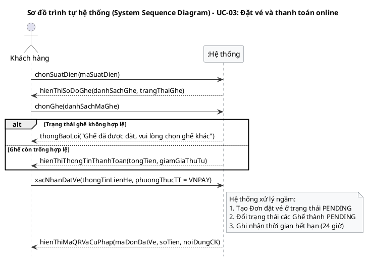
```plantuml
@startuml UC03_SystemSequenceDiagram
skinparam defaultFontName Arial
skinparam arrowColor #333333
skinparam sequenceParticipantBackgroundColor #F8F9FA
skinparam sequenceParticipantBorderColor #6C757D
skinparam sequenceLifeLineBorderColor #6C757D
skinparam noteBackgroundColor #F8F9FA
skinparam noteBorderColor #6C757D
hide footbox

title Sơ đồ trình tự hệ thống (System Sequence Diagram) - UC-03: Đặt vé và thanh toán online

actor "Khách hàng" as KH
participant ":Hệ thống" as Sys

KH -> Sys : chonSuatDien(maSuatDien)
Sys --> KH : hienThiSoDoGhe(danhSachGhe, trangThaiGhe)

KH -> Sys : chonGhe(danhSachMaGhe)
alt Trạng thái ghế không hợp lệ
    Sys --> KH : thongBaoLoi("Ghế đã được đặt, vui lòng chọn ghế khác")
else Ghế còn trống hợp lệ
    Sys --> KH : hienThiThongTinThanhToan(tongTien, giamGiaThuTu)
end

KH -> Sys : xacNhanDatVe(thongTinLienHe, phuongThucTT = VNPAY)

note right of Sys
  Hệ thống xử lý ngầm:
  1. Tạo Đơn đặt vé ở trạng thái PENDING
  2. Đổi trạng thái các Ghế thành PENDING
  3. Ghi nhận thời gian hết hạn (24 giờ)
end note

Sys --> KH : hienThiMaQRVaCuPhap(maDonDatVe, soTien, noiDungCK)

@enduml
```

## `sơ đồ trình tự hệ thống UC04.puml`
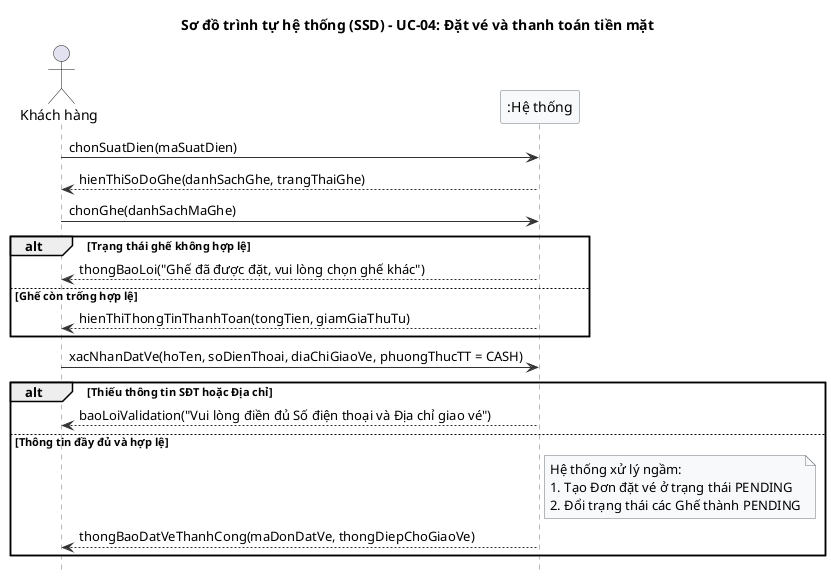
```plantuml
@startuml UC04_SystemSequenceDiagram
skinparam defaultFontName Arial
skinparam arrowColor #333333
skinparam sequenceParticipantBackgroundColor #F8F9FA
skinparam sequenceParticipantBorderColor #6C757D
skinparam sequenceLifeLineBorderColor #6C757D
skinparam noteBackgroundColor #F8F9FA
skinparam noteBorderColor #6C757D
hide footbox

title Sơ đồ trình tự hệ thống (SSD) - UC-04: Đặt vé và thanh toán tiền mặt

actor "Khách hàng" as KH
participant ":Hệ thống" as Sys

KH -> Sys : chonSuatDien(maSuatDien)
Sys --> KH : hienThiSoDoGhe(danhSachGhe, trangThaiGhe)

KH -> Sys : chonGhe(danhSachMaGhe)
alt Trạng thái ghế không hợp lệ
    Sys --> KH : thongBaoLoi("Ghế đã được đặt, vui lòng chọn ghế khác")
else Ghế còn trống hợp lệ
    Sys --> KH : hienThiThongTinThanhToan(tongTien, giamGiaThuTu)
end

KH -> Sys : xacNhanDatVe(hoTen, soDienThoai, diaChiGiaoVe, phuongThucTT = CASH)

alt Thiếu thông tin SĐT hoặc Địa chỉ
    Sys --> KH : baoLoiValidation("Vui lòng điền đủ Số điện thoại và Địa chỉ giao vé")
else Thông tin đầy đủ và hợp lệ
    note right of Sys
      Hệ thống xử lý ngầm:
      1. Tạo Đơn đặt vé ở trạng thái PENDING
      2. Đổi trạng thái các Ghế thành PENDING
    end note
    Sys --> KH : thongBaoDatVeThanhCong(maDonDatVe, thongDiepChoGiaoVe)
end

@enduml
```

## `sơ đồ trình tự hệ thống UC06.puml`
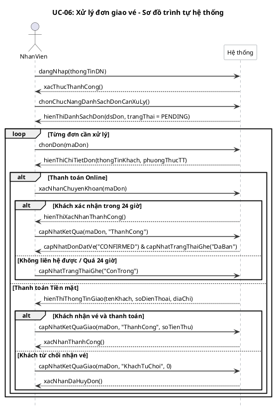
```plantuml
@startuml UC06_SystemSequenceDiagram
skinparam defaultFontName Arial
skinparam defaultFontSize 12
skinparam sequenceArrowThickness 1.5
skinparam sequenceParticipantBackgroundColor #FFFFFF
skinparam sequenceParticipantBorderColor #6C757D
skinparam sequenceLifeLineBorderColor #6C757D
skinparam sequenceArrowColor #333333
hide footbox

title UC-06: Xử lý đơn giao vé - Sơ đồ trình tự hệ thống

actor "NhanVien" as NV
participant "Hệ thống" as HT

NV -> HT : dangNhap(thongTinDN)
HT --> NV : xacThucThanhCong()

NV -> HT : chonChucNangDanhSachDonCanXuLy()
HT --> NV : hienThiDanhSachDon(dsDon, trangThai = PENDING)

loop Từng đơn cần xử lý
  NV -> HT : chonDon(maDon)
  HT --> NV : hienThiChiTietDon(thongTinKhach, phuongThucTT)

  alt Thanh toán Online
    NV -> HT : xacNhanChuyenKhoan(maDon)

    alt Khách xác nhận trong 24 giờ
      HT --> NV : hienThiXacNhanThanhCong()
      NV -> HT : capNhatKetQua(maDon, "ThanhCong")
      HT --> NV : capNhatDonDatVe("CONFIRMED") & capNhatTrangThaiGhe("DaBan")

    else Không liên hệ được / Quá 24 giờ
      NV -> HT : capNhatTrangThaiGhe("ConTrong")
    end

  else Thanh toán Tiền mặt
    HT --> NV : hienThiThongTinGiao(tenKhach, soDienThoai, diaChi)

    alt Khách nhận vé và thanh toán
      NV -> HT : capNhatKetQuaGiao(maDon, "ThanhCong", soTienThu)
      HT --> NV : xacNhanThanhCong()

    else Khách từ chối nhận vé
      NV -> HT : capNhatKetQuaGiao(maDon, "KhachTuChoi", 0)
      HT --> NV : xacNhanDaHuyDon()
    end
  end
end

@enduml
```

## `Sơ đồ tuần tự mức nghiệp vụ UC03.puml`
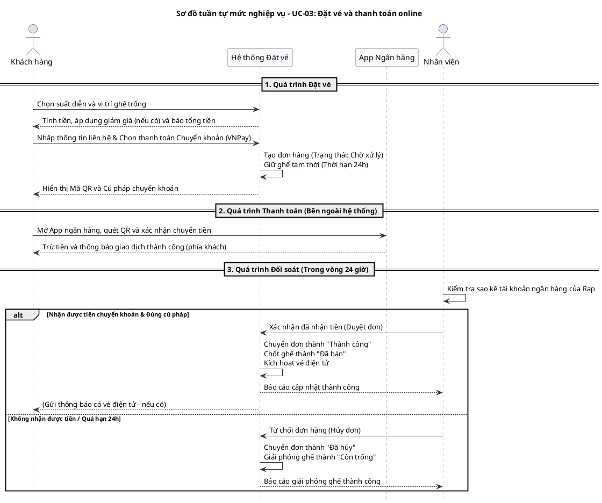
```plantuml
@startuml UC03_BusinessSequenceDiagram
skinparam defaultFontName Arial
skinparam classAttributeIconSize 0
skinparam classBackgroundColor #F8F9FA
skinparam classBorderColor #6C757D
skinparam arrowColor #333333
skinparam sequenceParticipantBackgroundColor #F8F9FA
skinparam sequenceParticipantBorderColor #6C757D
skinparam sequenceLifeLineBorderColor #6C757D
skinparam noteBackgroundColor #F8F9FA
skinparam noteBorderColor #6C757D
hide footbox

title Sơ đồ tuần tự mức nghiệp vụ - UC-03: Đặt vé và thanh toán online

actor "Khách hàng" as KH
participant "Hệ thống Đặt vé" as Sys
participant "App Ngân hàng" as Bank
actor "Nhân viên" as NV

== 1. Quá trình Đặt vé ==
KH -> Sys : Chọn suất diễn và vị trí ghế trống
Sys --> KH : Tính tiền, áp dụng giảm giá (nếu có) và báo tổng tiền

KH -> Sys : Nhập thông tin liên hệ & Chọn thanh toán Chuyển khoản (VNPay)
Sys -> Sys : Tạo đơn hàng (Trạng thái: Chờ xử lý)\nGiữ ghế tạm thời (Thời hạn 24h)
Sys --> KH : Hiển thị Mã QR và Cú pháp chuyển khoản

== 2. Quá trình Thanh toán (Bên ngoài hệ thống) ==
KH -> Bank : Mở App ngân hàng, quét QR và xác nhận chuyển tiền
Bank --> KH : Trừ tiền và thông báo giao dịch thành công (phía khách)

== 3. Quá trình Đối soát (Trong vòng 24 giờ) ==
NV -> NV : Kiểm tra sao kê tài khoản ngân hàng của Rạp

alt Nhận được tiền chuyển khoản & Đúng cú pháp
    NV -> Sys : Xác nhận đã nhận tiền (Duyệt đơn)
    Sys -> Sys : Chuyển đơn thành "Thành công"\nChốt ghế thành "Đã bán"\nKích hoạt vé điện tử
    Sys --> NV : Báo cáo cập nhật thành công
    Sys --> KH : (Gửi thông báo có vé điện tử - nếu có)

else Không nhận được tiền / Quá hạn 24h
    NV -> Sys : Từ chối đơn hàng (Hủy đơn)
    Sys -> Sys : Chuyển đơn thành "Đã hủy"\nGiải phóng ghế thành "Còn trống"
    Sys --> NV : Báo cáo giải phóng ghế thành công
end

@enduml
```

## `sơ đồ tuần tụ mức nghiệp vụ UC04.puml`
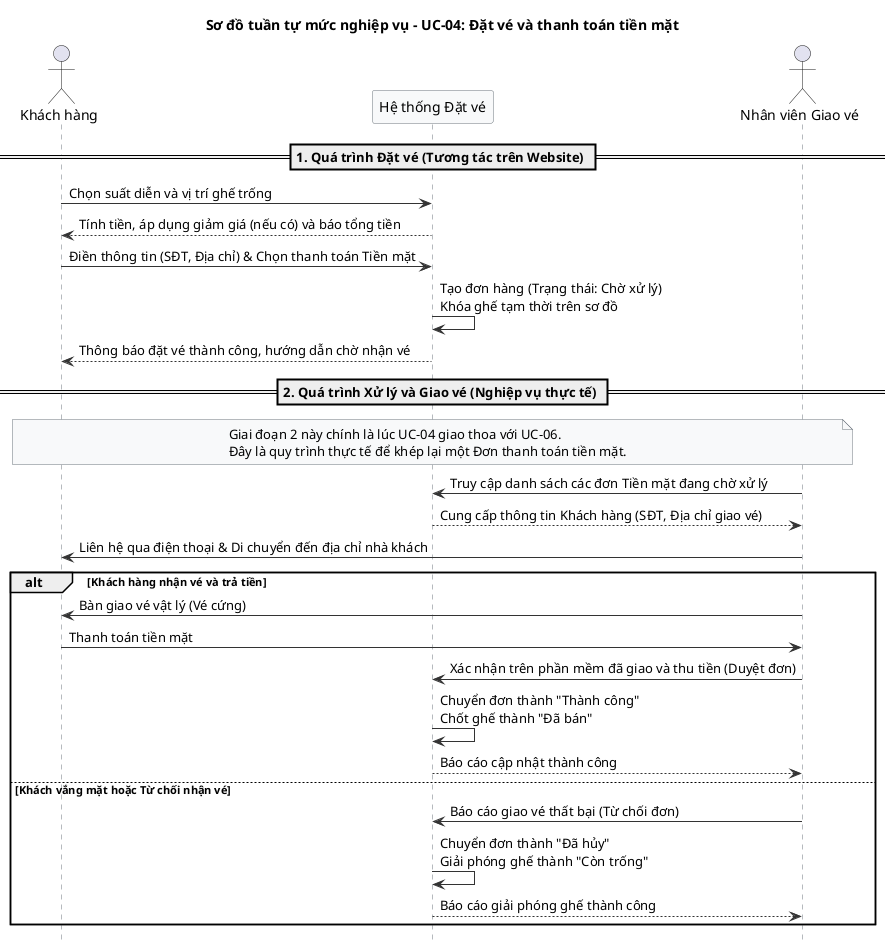
```plantuml
@startuml UC04_BusinessSequenceDiagram
skinparam defaultFontName Arial
skinparam classAttributeIconSize 0
skinparam classBackgroundColor #F8F9FA
skinparam classBorderColor #6C757D
skinparam arrowColor #333333


skinparam sequenceParticipantBackgroundColor #F8F9FA
skinparam sequenceParticipantBorderColor #6C757D
skinparam sequenceLifeLineBorderColor #6C757D
skinparam noteBackgroundColor #F8F9FA
skinparam noteBorderColor #6C757D
hide footbox

title Sơ đồ tuần tự mức nghiệp vụ - UC-04: Đặt vé và thanh toán tiền mặt

actor "Khách hàng" as KH
participant "Hệ thống Đặt vé" as Sys
actor "Nhân viên Giao vé" as NV

== 1. Quá trình Đặt vé (Tương tác trên Website) ==
KH -> Sys : Chọn suất diễn và vị trí ghế trống
Sys --> KH : Tính tiền, áp dụng giảm giá (nếu có) và báo tổng tiền

KH -> Sys : Điền thông tin (SĐT, Địa chỉ) & Chọn thanh toán Tiền mặt
Sys -> Sys : Tạo đơn hàng (Trạng thái: Chờ xử lý)\nKhóa ghế tạm thời trên sơ đồ
Sys --> KH : Thông báo đặt vé thành công, hướng dẫn chờ nhận vé

== 2. Quá trình Xử lý và Giao vé (Nghiệp vụ thực tế) ==
note over KH, NV
  Giai đoạn 2 này chính là lúc UC-04 giao thoa với UC-06.
  Đây là quy trình thực tế để khép lại một Đơn thanh toán tiền mặt.
end note

NV -> Sys : Truy cập danh sách các đơn Tiền mặt đang chờ xử lý
Sys --> NV : Cung cấp thông tin Khách hàng (SĐT, Địa chỉ giao vé)

NV -> KH : Liên hệ qua điện thoại & Di chuyển đến địa chỉ nhà khách

alt Khách hàng nhận vé và trả tiền
    NV -> KH : Bàn giao vé vật lý (Vé cứng)
    KH -> NV : Thanh toán tiền mặt
    NV -> Sys : Xác nhận trên phần mềm đã giao và thu tiền (Duyệt đơn)
    Sys -> Sys : Chuyển đơn thành "Thành công"\nChốt ghế thành "Đã bán"
    Sys --> NV : Báo cáo cập nhật thành công

else Khách vắng mặt hoặc Từ chối nhận vé
    NV -> Sys : Báo cáo giao vé thất bại (Từ chối đơn)
    Sys -> Sys : Chuyển đơn thành "Đã hủy"\nGiải phóng ghế thành "Còn trống"
    Sys --> NV : Báo cáo giải phóng ghế thành công
end

@enduml
```

## `Sơ đồ tuần tự mức nghiệp vụ UC06.puml`
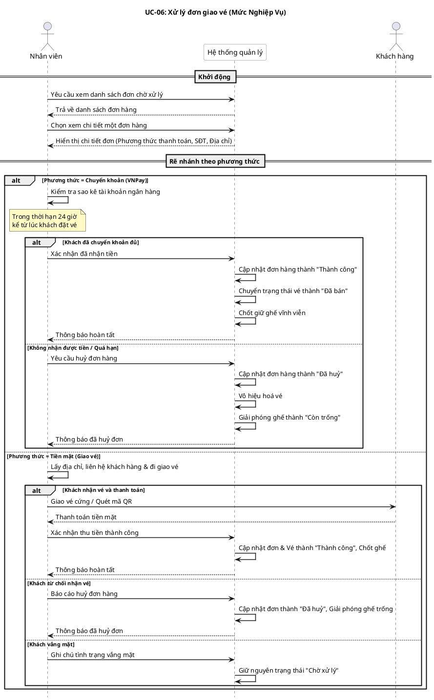
```plantuml
@startuml UC06_NghiepVu
skinparam defaultFontName Arial
skinparam sequenceArrowThickness 1.5
skinparam sequenceParticipantBackgroundColor #FFFFFF
skinparam sequenceParticipantBorderColor #6C757D
skinparam noteBackgroundColor #FFF9C4
hide footbox
title UC-06: Xử lý đơn giao vé (Mức Nghiệp Vụ)

actor "Nhân viên" as NV
participant "Hệ thống quản lý" as SYS
actor "Khách hàng" as KH

== Khởi động ==
NV -> SYS : Yêu cầu xem danh sách đơn chờ xử lý
SYS --> NV : Trả về danh sách đơn hàng
NV -> SYS : Chọn xem chi tiết một đơn hàng
SYS --> NV : Hiển thị chi tiết đơn (Phương thức thanh toán, SĐT, Địa chỉ)

== Rẽ nhánh theo phương thức ==

alt Phương thức = Chuyển khoản (VNPay)
  NV -> NV : Kiểm tra sao kê tài khoản ngân hàng
  note over NV
    Trong thời hạn 24 giờ 
    kể từ lúc khách đặt vé
  end note

  alt Khách đã chuyển khoản đủ
    NV -> SYS : Xác nhận đã nhận tiền
    SYS -> SYS : Cập nhật đơn hàng thành "Thành công"
    SYS -> SYS : Chuyển trạng thái vé thành "Đã bán"
    SYS -> SYS : Chốt giữ ghế vĩnh viễn
    SYS --> NV : Thông báo hoàn tất
  else Không nhận được tiền / Quá hạn
    NV -> SYS : Yêu cầu huỷ đơn hàng
    SYS -> SYS : Cập nhật đơn hàng thành "Đã huỷ"
    SYS -> SYS : Vô hiệu hoá vé
    SYS -> SYS : Giải phóng ghế thành "Còn trống"
    SYS --> NV : Thông báo đã huỷ đơn
  end

else Phương thức = Tiền mặt (Giao vé)
  NV -> NV : Lấy địa chỉ, liên hệ khách hàng & đi giao vé

  alt Khách nhận vé và thanh toán
    NV -> KH : Giao vé cứng / Quét mã QR
    KH --> NV : Thanh toán tiền mặt
    NV -> SYS : Xác nhận thu tiền thành công
    SYS -> SYS : Cập nhật đơn & Vé thành "Thành công", Chốt ghế
    SYS --> NV : Thông báo hoàn tất
  else Khách từ chối nhận vé
    NV -> SYS : Báo cáo huỷ đơn hàng
    SYS -> SYS : Cập nhật đơn thành "Đã huỷ", Giải phóng ghế trống
    SYS --> NV : Thông báo đã huỷ đơn
  else Khách vắng mặt
    NV -> SYS : Ghi chú tình trạng vắng mặt
    SYS -> SYS : Giữ nguyên trạng thái "Chờ xử lý"
  end
end

@enduml
```

## `Sơ đồ tuần tự mức thực tế UC03.puml`
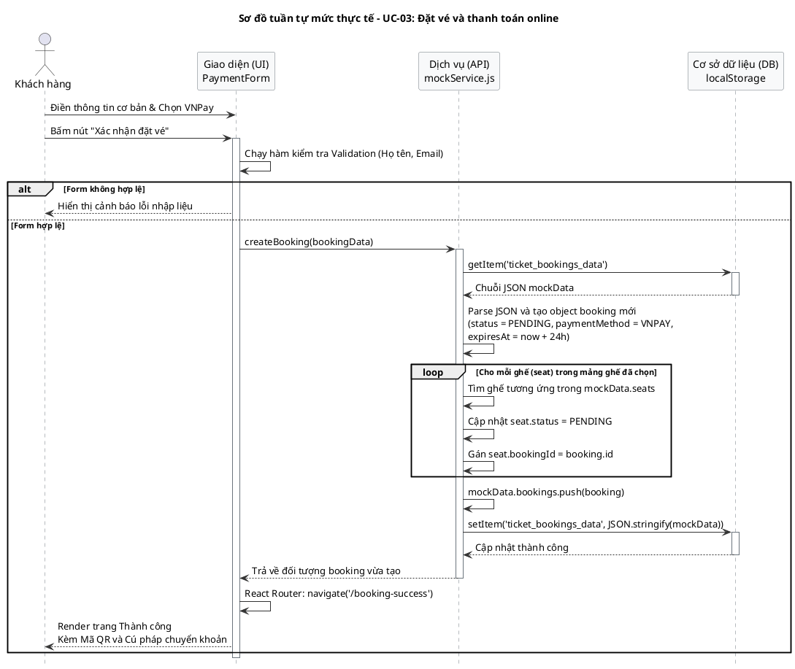
```plantuml
@startuml UC03_ImplementationSequenceDiagram
skinparam defaultFontName Arial
skinparam classAttributeIconSize 0
skinparam classBackgroundColor #F8F9FA
skinparam classBorderColor #6C757D
skinparam arrowColor #333333

' Đồng bộ màu sắc cho Sequence Diagram
skinparam sequenceParticipantBackgroundColor #F8F9FA
skinparam sequenceParticipantBorderColor #6C757D
skinparam sequenceLifeLineBorderColor #6C757D
skinparam noteBackgroundColor #F8F9FA
skinparam noteBorderColor #6C757D
hide footbox

title Sơ đồ tuần tự mức thực tế - UC-03: Đặt vé và thanh toán online

actor "Khách hàng" as KH
participant "Giao diện (UI)\nPaymentForm" as UI
participant "Dịch vụ (API)\nmockService.js" as API
participant "Cơ sở dữ liệu (DB)\nlocalStorage" as DB

KH -> UI : Điền thông tin cơ bản & Chọn VNPay
KH -> UI : Bấm nút "Xác nhận đặt vé"
activate UI

UI -> UI : Chạy hàm kiểm tra Validation (Họ tên, Email)

alt Form không hợp lệ
    UI --> KH : Hiển thị cảnh báo lỗi nhập liệu
else Form hợp lệ
    UI -> API : createBooking(bookingData)
    activate API
    
    API -> DB : getItem('ticket_bookings_data')
    activate DB
    DB --> API : Chuỗi JSON mockData
    deactivate DB
    
    API -> API : Parse JSON và tạo object booking mới\n(status = PENDING, paymentMethod = VNPAY,\nexpiresAt = now + 24h)
    
    loop Cho mỗi ghế (seat) trong mảng ghế đã chọn
        API -> API : Tìm ghế tương ứng trong mockData.seats
        API -> API : Cập nhật seat.status = PENDING
        API -> API : Gán seat.bookingId = booking.id
    end loop
    
    API -> API : mockData.bookings.push(booking)
    
    API -> DB : setItem('ticket_bookings_data', JSON.stringify(mockData))
    activate DB
    DB --> API : Cập nhật thành công
    deactivate DB
    
    API --> UI : Trả về đối tượng booking vừa tạo
    deactivate API
    
    UI -> UI : React Router: navigate('/booking-success')
    UI --> KH : Render trang Thành công\nKèm Mã QR và Cú pháp chuyển khoản
end

deactivate UI

@enduml
```

## `Sơ đồ tuần tự mức thực tế UC04.puml`
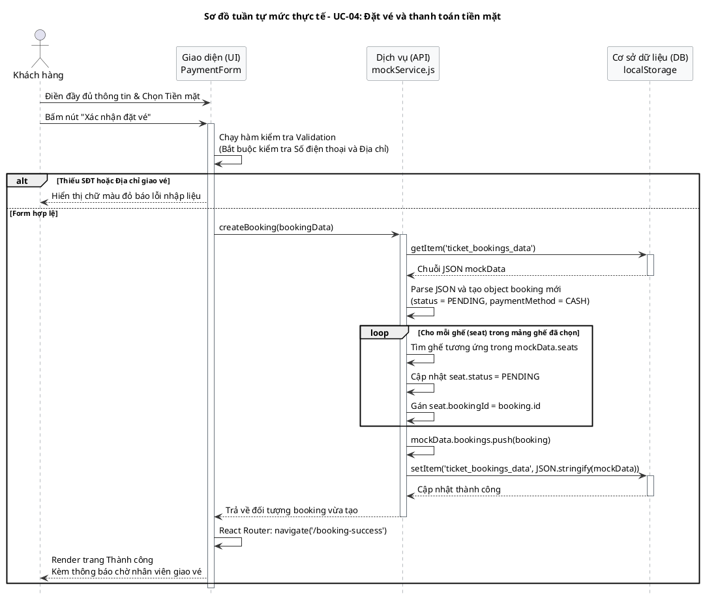
```plantuml
@startuml UC04_ImplementationSequenceDiagram
skinparam defaultFontName Arial
skinparam classAttributeIconSize 0
skinparam classBackgroundColor #F8F9FA
skinparam classBorderColor #6C757D
skinparam arrowColor #333333

' Đồng bộ màu sắc cho Sequence Diagram
skinparam sequenceParticipantBackgroundColor #F8F9FA
skinparam sequenceParticipantBorderColor #6C757D
skinparam sequenceLifeLineBorderColor #6C757D
skinparam noteBackgroundColor #F8F9FA
skinparam noteBorderColor #6C757D
hide footbox

title Sơ đồ tuần tự mức thực tế - UC-04: Đặt vé và thanh toán tiền mặt

actor "Khách hàng" as KH
participant "Giao diện (UI)\nPaymentForm" as UI
participant "Dịch vụ (API)\nmockService.js" as API
participant "Cơ sở dữ liệu (DB)\nlocalStorage" as DB

KH -> UI : Điền đầy đủ thông tin & Chọn Tiền mặt
KH -> UI : Bấm nút "Xác nhận đặt vé"
activate UI

UI -> UI : Chạy hàm kiểm tra Validation\n(Bắt buộc kiểm tra Số điện thoại và Địa chỉ)

alt Thiếu SĐT hoặc Địa chỉ giao vé
    UI --> KH : Hiển thị chữ màu đỏ báo lỗi nhập liệu
else Form hợp lệ
    UI -> API : createBooking(bookingData)
    activate API
    
    API -> DB : getItem('ticket_bookings_data')
    activate DB
    DB --> API : Chuỗi JSON mockData
    deactivate DB
    
    API -> API : Parse JSON và tạo object booking mới\n(status = PENDING, paymentMethod = CASH)
    
    loop Cho mỗi ghế (seat) trong mảng ghế đã chọn
        API -> API : Tìm ghế tương ứng trong mockData.seats
        API -> API : Cập nhật seat.status = PENDING
        API -> API : Gán seat.bookingId = booking.id
    end loop
    
    API -> API : mockData.bookings.push(booking)
    
    API -> DB : setItem('ticket_bookings_data', JSON.stringify(mockData))
    activate DB
    DB --> API : Cập nhật thành công
    deactivate DB
    
    API --> UI : Trả về đối tượng booking vừa tạo
    deactivate API
    
    UI -> UI : React Router: navigate('/booking-success')
    UI --> KH : Render trang Thành công\nKèm thông báo chờ nhân viên giao vé
end

deactivate UI

@enduml
```

## `Sơ đồ tuần tự mức thực tế UC06.puml`
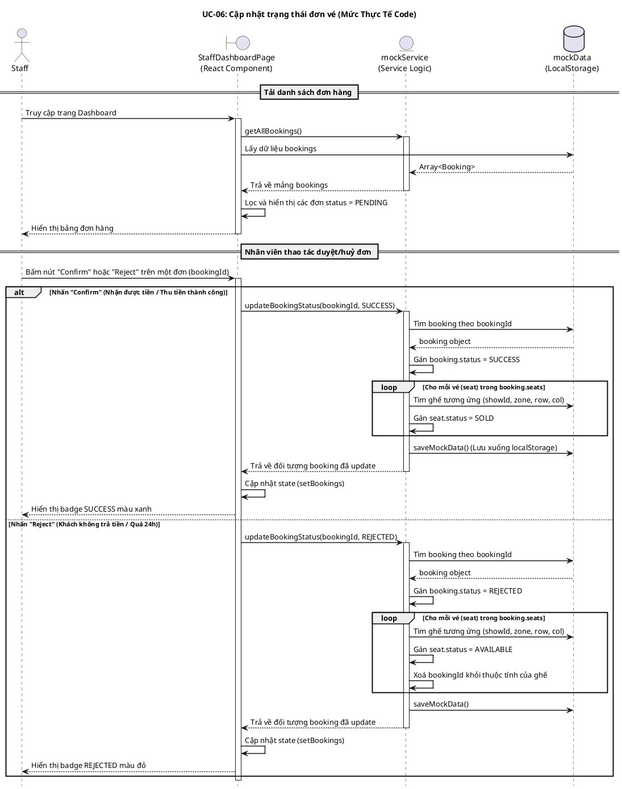
```plantuml
@startuml UC06_ThucTe
skinparam defaultFontName Arial
skinparam sequenceArrowThickness 1.5
skinparam sequenceParticipantBackgroundColor #FFFFFF
skinparam sequenceParticipantBorderColor #6C757D
skinparam noteBackgroundColor #E3F2FD
hide footbox
title UC-06: Cập nhật trạng thái đơn vé (Mức Thực Tế Code)

actor "Staff" as NV
boundary "StaffDashboardPage\n(React Component)" as UI
entity "mockService\n(Service Logic)" as API
database "mockData\n(LocalStorage)" as DB

== Tải danh sách đơn hàng ==
NV -> UI : Truy cập trang Dashboard
activate UI
UI -> API : getAllBookings()
activate API
UI -> DB : Lấy dữ liệu bookings
DB --> API : Array<Booking>
API --> UI : Trả về mảng bookings
deactivate API
UI -> UI : Lọc và hiển thị các đơn status = PENDING
UI --> NV : Hiển thị bảng đơn hàng
deactivate UI

== Nhân viên thao tác duyệt/huỷ đơn ==

NV -> UI : Bấm nút "Confirm" hoặc "Reject" trên một đơn (bookingId)
activate UI

alt Nhấn "Confirm" (Nhận được tiền / Thu tiền thành công)
  UI -> API : updateBookingStatus(bookingId, SUCCESS)
  activate API
  API -> DB : Tìm booking theo bookingId
  DB --> API : booking object
  API -> API : Gán booking.status = SUCCESS
  
  loop Cho mỗi vé (seat) trong booking.seats
    API -> DB : Tìm ghế tương ứng (showId, zone, row, col)
    API -> API : Gán seat.status = SOLD
  end loop
  
  API -> DB : saveMockData() (Lưu xuống localStorage)
  API --> UI : Trả về đối tượng booking đã update
  deactivate API
  
  UI -> UI : Cập nhật state (setBookings)
  UI --> NV : Hiển thị badge SUCCESS màu xanh

else Nhấn "Reject" (Khách không trả tiền / Quá 24h)
  UI -> API : updateBookingStatus(bookingId, REJECTED)
  activate API
  API -> DB : Tìm booking theo bookingId
  DB --> API : booking object
  API -> API : Gán booking.status = REJECTED
  
  loop Cho mỗi vé (seat) trong booking.seats
    API -> DB : Tìm ghế tương ứng (showId, zone, row, col)
    API -> API : Gán seat.status = AVAILABLE
    API -> API : Xoá bookingId khỏi thuộc tính của ghế
  end loop
  
  API -> DB : saveMockData()
  API --> UI : Trả về đối tượng booking đã update
  deactivate API
  
  UI -> UI : Cập nhật state (setBookings)
  UI --> NV : Hiển thị badge REJECTED màu đỏ

end
deactivate UI

@enduml
```

## `sơ đồ trạng thái ghế.puml`
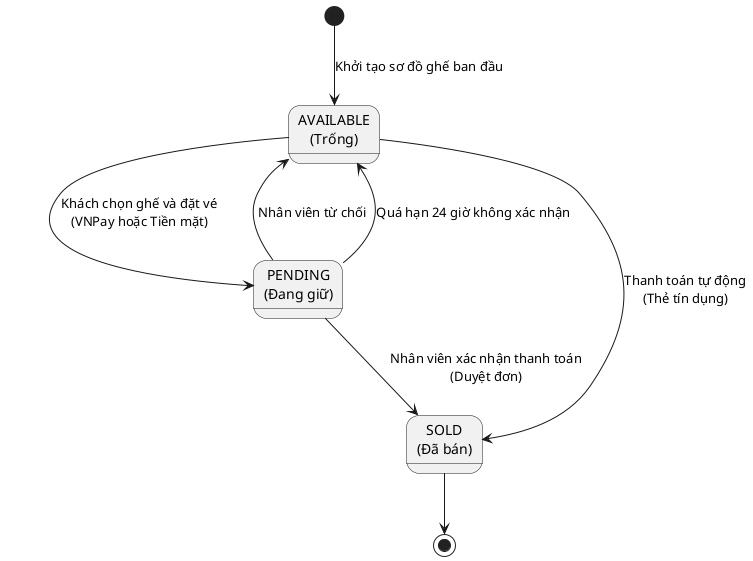
```plantuml
@startuml
state "AVAILABLE\n(Trống)" as AVAILABLE
state "PENDING\n(Đang giữ)" as PENDING
state "SOLD\n(Đã bán)" as SOLD

[*] --> AVAILABLE : Khởi tạo sơ đồ ghế ban đầu

AVAILABLE --> PENDING : Khách chọn ghế và đặt vé\n(VNPay hoặc Tiền mặt)

AVAILABLE --> SOLD : Thanh toán tự động\n(Thẻ tín dụng)

PENDING --> SOLD : Nhân viên xác nhận thanh toán\n(Duyệt đơn)

PENDING --> AVAILABLE : Nhân viên từ chối
PENDING --> AVAILABLE : Quá hạn 24 giờ không xác nhận

SOLD --> [*]

@enduml
```

## `sơ đồ trạng thai donDatVe.puml`
```plantuml
@startuml

    %% Các trạng thái của Đơn đặt vé
    state "PENDING (Chờ thanh toán)" as PENDING
    state "SUCCESS (Thành công)" as SUCCESS
    state "REJECTED (Bị huỷ/Từ chối)" as REJECTED

    [*] --> PENDING : Tạo đơn mới\n(Phương thức VNPay / Tiền mặt)
    
    PENDING --> SUCCESS : Nhân viên xác nhận đã nhận tiền\n(Duyệt đơn)
    PENDING --> REJECTED : Nhân viên từ chối đơn HOẶC\nHệ thống tự huỷ sau 24h (Reject)
    
    SUCCESS --> [*]
    REJECTED --> [*]

@enduml
```

## `kiến trúc phân tầng.puml`
```plantuml
@startuml LayeredArchitecture
skinparam linetype ortho
skinparam defaultFontName Arial
skinparam defaultFontSize 12
skinparam BackgroundColor #FFFFFF
skinparam ArrowColor #6C757D

' Cấu hình màu sắc các tầng
skinparam package {
    BackgroundColor<<Presentation>> #EBF5FB
    BorderColor<<Presentation>> #2980B9
    BackgroundColor<<API>> #E8F8F5
    BorderColor<<API>> #1ABC9C
    BackgroundColor<<Business>> #FEF9E7
    BorderColor<<Business>> #F1C40F
    BackgroundColor<<Data>> #FBEEE6
    BorderColor<<Data>> #E67E22
    BackgroundColor<<Infrastructure>> #F2F3F4
    BorderColor<<Infrastructure>> #7F8C8D
}

skinparam databaseBackgroundColor #FDEDEC
skinparam databaseBorderColor #E74C3C

package "Presentation Layer (Tầng Giao diện - Client)" <<Presentation>> {
    [React Pages & Components\n(ShowList, SeatMap, PaymentForm)] as UI
    [State Management\n(Context API / Redux)] as State
    [UI Styling\n(Tailwind CSS & CSS Modules)] as Style
}

package "API Gateway / Routing Layer (Tầng Giao tiếp)" <<API>> {
    [API Client\n(mockService.js / Axios)] as APIClient
    [API Router & Controllers\n(Express Router / Endpoints)] as Controllers
}

package "Business Logic Layer (Tầng Nghiệp vụ)" <<Business>> {
    [Booking Service\n(Xử lý đặt vé, giữ ghế 24h)] as BookingSvc
    [Payment Service\n(Xử lý giao dịch VNPay / Tiền mặt)] as PaymentSvc
    [Show & Seat Service\n(Quản lý suất diễn & sơ đồ ghế)] as ShowSvc
    [Ticket Service\n(Sinh QR Code & soát vé)] as TicketSvc
}

package "Data Access Layer (Tầng Dữ liệu)" <<Data>> {
    [Database Repositories\n(Queries / ORM)] as Repos
}

package "Infrastructure Layer (Tầng Hạ tầng & Tích hợp)" <<Infrastructure>> {
    database "Database (MySQL / LocalStorage)" as DB
    [VNPay Payment Gateway] as VNPayAPI
}

' Định nghĩa các luồng tương tác giữa các tầng
UI -down-> State : update state
State -down-> APIClient : call requests
APIClient .down.> Controllers : HTTP Request (JSON API)

Controllers -down-> BookingSvc : gọi nghiệp vụ đặt vé
Controllers -down-> PaymentSvc : gọi nghiệp vụ thanh toán
Controllers -down-> ShowSvc : lấy thông tin suất diễn
Controllers -down-> TicketSvc : gọi nghiệp vụ phát hành vé

BookingSvc -down-> Repos
PaymentSvc -down-> Repos
ShowSvc -down-> Repos
TicketSvc -down-> Repos

Repos -down-> DB : Read/Write SQL/JSON
PaymentSvc -right-> VNPayAPI : Gọi tích hợp thanh toán (Redirect / Callback URL)

@enduml
```

## `sơ đồ package.puml`
```plantuml
@startuml PackageDiagram
skinparam linetype ortho
skinparam defaultFontName Arial
skinparam defaultFontSize 12
skinparam BackgroundColor #FFFFFF
skinparam ArrowColor #6C757D

' Cấu hình màu sắc cho các Package
skinparam package {
    BackgroundColor #F8F9FA
    BorderColor #6C757D
    FontColor #333333
}

package "src" as src_pkg {
    
    package "pages" as pages_pkg #EBF5FB {
        [HomePage]
        [ShowDetailsPage]
        [MyTicketsPage]
        [AdminDashboardPage]
        [StaffDashboardPage]
        [AuthPages\n(Login / Register)]
    }

    package "components" as components_pkg #E8F8F5 {
        package "ui" as ui_pkg #D1F2EB {
            [Button]
            [Input]
            [Card]
            [Badge]
            [Alert]
        }
        [SeatingChart]
        [PaymentForm]
        [TicketCard]
        [BookingSummary]
    }

    package "services" as services_pkg #FEF9E7 {
        [mockService]
        [authService]
        [bookingService]
        [showService]
    }

    package "hooks" as hooks_pkg #FBEEE6 {
        [useBooking]
        [useWednesdayDiscount]
    }

    package "utils" as utils_pkg #F2F3F4 {
        [constants]
        [ticketUtils]
        [dateUtils]
        [validation]
    }
}

' Mối quan hệ phụ thuộc (Dependencies)
pages_pkg .down.> components_pkg : <<use>>\nimport các thành phần giao diện
pages_pkg .down.> hooks_pkg : <<use>>\nsử dụng logic nghiệp vụ
pages_pkg .down.> services_pkg : <<call>>\ngọi API / mock data trực tiếp

components_pkg .down.> ui_pkg : <<include>>\nxây dựng từ UI cơ bản
components_pkg .down.> utils_pkg : <<use>>\nđịnh dạng dữ liệu & nhãn ghế

hooks_pkg .down.> services_pkg : <<call>>\ntương tác dữ liệu
hooks_pkg .down.> utils_pkg : <<use>>\ntính toán / kiểm tra hằng số

services_pkg .down.> utils_pkg : <<use>>\nsử dụng constants cấu hình hệ thống
@enduml
```

## `sơ đồ triển khai.puml`
```plantuml
@startuml DeploymentDiagram
skinparam linetype ortho
skinparam defaultFontName Arial
skinparam defaultFontSize 12
skinparam BackgroundColor #FFFFFF
skinparam ArrowColor #6C757D

' Cấu hình màu sắc cho các thành phần vật lý
skinparam node {
    BackgroundColor #F8F9FA
    BorderColor #6C757D
    FontColor #333333
}

skinparam database {
    BackgroundColor #FDEDEC
    BorderColor #E74C3C
}

skinparam artifact {
    BackgroundColor #EBF5FB
    BorderColor #2980B9
}

' Định nghĩa các Nút (Nodes) vật lý
node "Thiết bị người dùng\n(PC / Mobile / Tablet)" as ClientDevice {
    node "Trình duyệt Web\n(Chrome, Safari, Edge)" as Browser {
        artifact "React Web Application\n(SPA Bundle - Client Side)" as ReactApp
    }
}

node "Máy chủ lưu trữ tĩnh\n(Vercel / Netlify / AWS S3)" as StaticHosting {
    artifact "Tài nguyên Tĩnh\n(HTML, JS, CSS, Images)" as StaticAssets
}

node "Máy chủ Ứng dụng (App Server)\n(AWS EC2 / VPS Linux)" as AppServer {
    node "Môi trường Node.js / Java" as RunTime {
        artifact "Backend API Application\n(Node.js Express / Spring Boot)" as BackendAPI
    }
}

node "Máy chủ Cơ sở Dữ liệu\n(AWS RDS / MySQL Server)" as DbServer {
    database "Hệ Quản trị CSDL\n(MySQL / PostgreSQL Database)" as RelationalDb
}

node "Mạng lưới Cổng Thanh Toán" as PaymentNetwork {
    node "Hệ thống VNPay Sandbox / Production" as VNPayGateway
}

' Kết nối và Giao thức truyền thông (Protocols)
ReactApp .up.> StaticAssets : 1. Tải tài nguyên tĩnh\n[HTTPS / CDN]
ReactApp -down-> BackendAPI : 2. Gửi yêu cầu đặt vé & lấy data\n[HTTPS / REST API / JSON]
BackendAPI -down-> RelationalDb : 3. Đọc/ghi thông tin vé, ghế, người dùng\n[TCP/IP - Port 3306 / ORM]
ReactApp -right-> VNPayGateway : 4. Điều hướng khách hàng thanh toán\n[HTTPS / Redirect]
VNPayGateway -left-> BackendAPI : 5. Gửi kết quả giao dịch đối soát (IPN)\n[HTTPS / Secure Callback]

@enduml
```

## `sơ đồ lớp thiết kế.puml`
```plantuml
@startuml

skinparam classAttributeIconSize 0
skinparam classFontStyle bold
skinparam ArrowColor #333333
skinparam ClassBorderColor #444444

enum UserRole {
  customer
  staff
  manager
  accountant
}

enum BookingStatus {
  pending
  success
  rejected
}

enum PaymentMethod {
  cash
  card
  vnpay
}

enum Zone {
  zone_a
  zone_b
  level_2
}

enum SeatStatus {
  available
  selected
  pending
  sold
}

class User {
  +id: String
  +name: String
  +email: String
  +password: String
  +role: UserRole
  --
  +login(email, password): Token
  +register(name, email, password): User
  +logout(): void
  +hasRole(roles): Boolean
}

class DonDatVe {
  +id: String
  +userId: String
  +showId: String
  +paymentMethod: PaymentMethod
  +totalAmount: Number
  +baseAmount: Number
  +status: BookingStatus
  +contactPhone: String
  +deliveryAddress: String
  +createdAt: DateTime
  --
  +calculateTotal(): Number
  +applyWednesdayDiscount(): Number
  +cancel(): void
}

class Ve {
  +id: String
  +bookingId: String
  +zone: Zone
  +row: Number
  +col: Number
  +seatNumber: String
  +price: Number
  --
  +generateTicketId(): String
  +generateQRCode(): String
  +parseSeatNumber(): Object
}

class Show {
  +id: String
  +name: String
  +description: String
  +image: String
  +date: DateTime
  +status: String
  +pricing: Pricing
  --
  +isWednesday(): Boolean
  +getDiscountedPrice(zone): Number
}

class GheNgoi {
  +id: String
  +showId: String
  +zone: Zone
  +row: Number
  +col: Number
  +status: SeatStatus
  +bookingId: String
  --
  +getSeatNumber(): String
  +isAvailable(): Boolean
}

class Pricing {
  +zone_a: Number
  +zone_b: Number
  +level_2: Number
}

class Discount {
  +wednesday: Number
}

class WednesdayDiscount {
  +DISCOUNT_RATE: Number = 0.3
  --
  +isWednesday(date): Boolean
  +calculateDiscount(basePrice): Number
  +getFinalPrice(basePrice): Number
}

class BaoCao {
  +revenueByShow: RevenueByShow[]
  +paymentMethods: PaymentMethodStats
  +totalRevenue: Number
  --
  +getRevenueReport(): BaoCao
  +getSeatOccupancy(): OccupancyReport[]
  +getBookingStats(): Object
  +getPaymentMethodStats(): Object
}

class RevenueByShow {
  +showName: String
  +revenue: Number
  +bookings: Number
}

class OccupancyReport {
  +showName: String
  +totalSeats: Number
  +soldSeats: Number
  +availableSeats: Number
  +occupancyRate: String
}

class PaymentMethodStats {
  +cash: Number
  +vnpay: Number
}

User "1" --> "0..*" DonDatVe : đặt
User ..> UserRole : có vai trò
User ..> BookingStatus : có trạng thái
DonDatVe "1" --> "1..*" Ve : được đặt trong
DonDatVe ..> PaymentMethod : thanh toán bằng
DonDatVe ..> Discount : áp dụng
DonDatVe --> WednesdayDiscount : sử dụng
Discount <|-- WednesdayDiscount
Show "1" --> "0..*" Ve : gắn với
Show "1" *-- "1" Pricing : cấu hình giá
Show "1" --> "0..*" GheNgoi : gồm
WednesdayDiscount --> Show : kiểm tra ngày
GheNgoi "0..1" --> "1" Ve : gắn với
GheNgoi ..> Zone : thuộc zone
GheNgoi ..> SeatStatus : có trạng thái
BaoCao "1" *-- "0..*" RevenueByShow : gồm
BaoCao "1" *-- "1" PaymentMethodStats : gồm
BaoCao "1" *-- "0..*" OccupancyReport : gồm
DonDatVe "0..*" ..> BaoCao : tổng hợp từ
Show "0..*" ..> BaoCao : tổng hợp từ

@enduml
```

## `sơ đồ ERD.dbml`
```dbml
// ==========================================
// TICKET BOOKING SYSTEM ERD (dbdiagram.io)
// ==========================================

Table Users {
  id varchar [primary key]
  name varchar
  email varchar [unique]
  password varchar
  role varchar [note: 'ADMIN, STAFF, CUSTOMER']
  avatar varchar
}

Table Shows {
  id varchar [primary key]
  name varchar
  description text
  image varchar
  date datetime
  pricing json [note: 'Lưu giá vé theo khu vực, VD: {"zone_a": 50, "zone_b": 40}']
  status varchar
}

Table Seats {
  id varchar [primary key]
  show_id varchar
  zone varchar
  row int
  col int
  status varchar [note: 'AVAILABLE, PENDING, SOLD']
  booking_id varchar [note: 'ID của đơn đặt vé đang giữ hoặc đã mua ghế này']
}

Table Bookings {
  id varchar [primary key]
  user_id varchar
  show_id varchar
  payment_method varchar [note: 'VNPAY hoặc CASH']
  total_amount decimal
  base_amount decimal
  discounts json [note: 'Lưu thông tin mã giảm giá, VD: Giảm giá thứ 4']
  contact_phone varchar
  delivery_address text [note: 'Bắt buộc điền nếu phương thức là CASH']
  status varchar [note: 'PENDING, SUCCESS, REJECTED']
  created_at datetime
  expires_at datetime [note: '24h tính từ created_at']
}

Table Tickets {
  id varchar [primary key]
  booking_id varchar
  seat_id varchar
  price decimal [note: 'Giá vé thực tế tại thời điểm mua']
}

// ==========================================
// ĐỊNH NGHĨA MỐI QUAN HỆ (RELATIONSHIPS)
// ==========================================

// Một Show (Suất diễn) có nhiều Seat (Ghế)
Ref: Seats.show_id > Shows.id

// Một User (Khách hàng) có thể có nhiều Booking (Đơn đặt vé)
Ref: Bookings.user_id > Users.id

// Một Show (Suất diễn) có nhiều Booking (Đơn đặt vé)
Ref: Bookings.show_id > Shows.id

// Một Booking (Đơn đặt vé) bao gồm nhiều Ticket (Vé chi tiết)
Ref: Tickets.booking_id > Bookings.id

// Một Ticket (Vé chi tiết) ánh xạ chính xác tới 1 Seat (Ghế) 
// (Quan hệ 1-1: Dấu `-` biểu diễn One-to-One)
Ref: Tickets.seat_id - Seats.id

// Quan hệ phụ: Một Ghế có thể tạm lưu trữ booking_id để truy xuất nhanh
Ref: Seats.booking_id > Bookings.id
```
